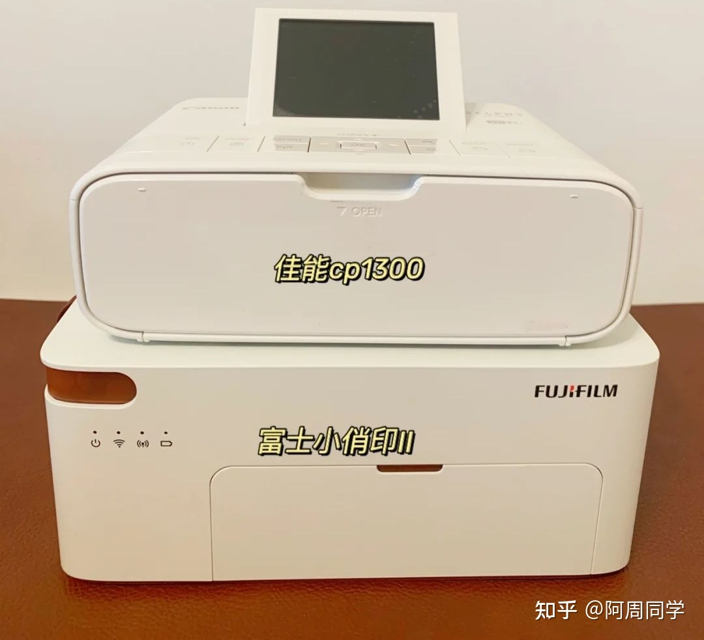

*#音量注意：没有调节音量的功能，播放前请注意设备音量*

<iframe src="//music.163.com/outchain/player?type=2&id=1314931825&auto=1&height=66" frameborder="0" width="100%" height="86px" ></iframe>

## 序-心血来潮

今天看了个人文摄影师的扫街视频。视频里小哥抓拍到好看的瞬间，能马上用一台洁白小巧的便携打印机打出来一张实体版的照片送给被拍的人，如果对方是坐着或者停留状态的话还会套个木头相框（不然打印加上装相框的十几秒对方走进人群消失了，照片打出来也送不出去了）。收到照片的路人第一反应都是：“哇，拍的真好，谢谢！”然后马上就会迟疑：“是不是要钱呀？”小哥就会留下一句“不要钱，只是觉得刚刚那一刻很美！免费的！再见！”然后潇洒离去。

这个视频让我突然开始**疯狂向往**这种**“拍的照片能马上定格在手里拿的相纸上”**的感觉。而且有了微单以后电脑里多出来不少存照片的文件夹，但是却很少打开；如果有个打印机，把喜欢的照片打出来挂在墙上，做个照片墙岂不是很nice？

说干就干，马上去了解一下打印机相关的东西。

### 分类

先对打印机进行了一个基本的了解，打印机原来也是分很多种类的。根据把数据转化到一张纸上的不同原理来分，可以大致分五类：

1. 针式打印机（`特殊1`）：

   靠打印头上的金属针撞击色带（可以理解为颜料）再撞击纸来记录内容的，这种打印机噪音大（想象一下商店出小票的机器滋滋滋的声音）、分辨率低（打印出来是点阵的效果，无法做到高清）、速度慢（这种机械结构注定了快不了），一般只用于打印发票、存折这种特殊（硬）的纸材。

2. 热敏打印机（`特殊2`）

   功耗低，没有墨粉墨盒，需要在专门的热敏纸上打印，加热头加热热敏纸上的区域就会变黑，优点是维护简单，耗材便宜，最致命的缺点是打印出来的文字过一段时间会慢慢变浅褪色，最终无法辨认。很多电影票、购物小票、快递标签等等都是这种方式打印的。

   > 小时候很好奇为什么商场门口的工作人员用手指头就能在小票上画出一个黑色的线（*代表已经结账），后来才知道是因为小票用的热敏纸，指甲快速划过，小票会因为摩擦受热，从而留下痕迹。

3. 喷墨打印机（`常用1`）：

   靠打印喷头把墨水喷在纸上记录内容，喷头技术有热发泡（容易堵但是可以自己处理）和微压电（不容易堵，但是坏了只能送修）两种，墨水有C、M、Y、BK四个颜色的，分为墨盒式（只能直接换墨盒，贵）和墨仓式（可以加墨水，成本低，但是操作比较有难度），优点是耗材便宜，耗电量小，打印彩色文件效果好，缺点是长时间不用容易堵喷头，貌似还得开水泡等等操作，反正不适合家用。

4. 激光打印机（`常用2`）：

   靠硒鼓和墨粉来记录内容，分为鼓粉一体（操作简单成本略高）和鼓粉分离（复杂一点成本低一点）两种耗材类型，优点是打印速度快，稳定性高，维护难度低，墨粉成本低，缺点是靠定影膜（加热速度快，效果好但是容易坏）或者加热管（加热速度慢但是耐磨）加热把碳粉固定在纸张上，~~刚打印完的纸拿着烫手（不是）~~打印彩色的精度不高，彩色墨粉价格还贵，墨粉泄露还可能危害环境和身体，而且机器会贵一点，如果对彩色打印没什么需求，使用频率也不高的话，可以考虑激光打印机。

   如果用了劣质碳粉导致碳粉粘在定影膜或者加热管上，造成频繁卡纸，需要清理加热管或者更换定影膜。

   > 另外彩色激光打印机：还分为水平成像和滚筒成像两种，水平成像有四个硒鼓，依次把图像输出到转印带上，然后二次转印到纸上，输出速度快，但是成本高；滚筒成像有一个硒鼓四个粉盒，四个粉盒依次工作，输出速度慢，但是成本低。

5. 热升华打印机（`便携`）：

   功耗低，没有墨粉墨盒，使用色带或者使用特殊的相纸，体积小，主要分三种技术：

   1. Zink无墨打印：相纸上有特殊晶体，晶体受温度控制发生相变，冷却后还会保持颜色，缺点是受温度影响会有色差，不够稳定，可能偏色。
   2. 拍立得-银盐打印：相纸底部有药水，通过化学反应显示图像，定形需要时间，图像风格化明显，有怀旧风格，但还原度差。
   3. 热升华打印：目前比较成熟的技术，通过高温将色带上的染料升华，转印到相纸上，会将三原色分开打印，再加上照片覆膜，照片需要在打印机里吞吐四次，还原度高，有覆膜保护相片保存时间长，后面我拿来对比的两款都是这个类型的。

分类看完了，说白了打印机的成本主要还不是打印机，而是**耗材**。机器便宜了，耗材就贵。机器贵了，耗材就便宜。（废话

### 正题：便携相片打印机

经过简单的搜索，锁定了两款热升华便携打印机，下面简单对比（图源水印）：

#### ①佳能（Canon） SELPHY CP1300

> 机器价格：全新700左右
>
> 耗材价格：6寸相纸1.65元
>
> 重量：860克，更加便携
>
> 尺寸：180.6x135.9x63.3(mm)，但是相纸需要单独收纳
>
> 特点：
>
> - 带一个3.2寸屏幕，和较多按键；
> - 兼容3、5、6寸相纸；
> - 电池需要另行购买，否则只能插电使用；
> - 色彩较亮较浅，饱和度较低。

#### ②富士（FUJIFILM）Princiao Smart 小俏印二代

> 机器价格：全新800左右
>
> 耗材价格：6寸相纸2.2元
>
> 重量：1300克，较重
>
> 尺寸：206.5×135.6x86.5(mm)，**相纸可以收纳到本体里面，非常便携**
>
> 特点：
>
> - 没有多余按键，圆角设计，整体比较清爽简约；
> - 只能用6寸相纸；
> - 自带电池；
> - 色彩更还原，接近原片。

经过了一番对比，最终选择了小俏印二代，最喜欢的是这个相纸盒收纳设计，一个方盒子就是一个整体，而且我觉得我不需要打印机上的那块小屏幕，打印什么照片肯定会在手机 APP 里就选好的，打印机上的按键和屏幕略显多余。

而且开头说的那个街头摄影师，他用的也是这台打印机，同款就很快乐👏

已经下单了，坐等收货后在下面更新几张图😋

### 随便说说

贵的东西，唯一的缺点就是贵；便宜的东西，唯一的优点就是便宜。

写这个的时候多次感受到这个真理👻

### 参考

[照片打印，选的是哪些打印机？回答1-知乎](https://www.zhihu.com/question/264024580/answer/2260766446)

[照片打印，选的是哪些打印机？回答2-知乎](https://www.zhihu.com/question/264024580/answer/1882083303)

[2022 年双十一口袋照片打印机选购推荐-知乎](https://zhuanlan.zhihu.com/p/273607608)